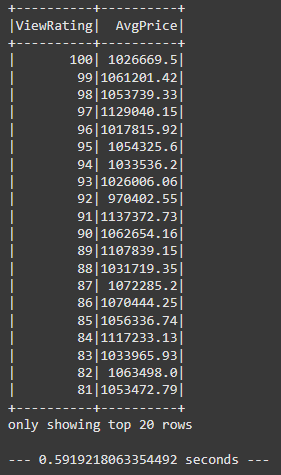

# Module 22: Home_Sales

## The Task
In this challenge, you'll use your knowledge of SparkSQL to determine key metrics about home sales data. Then you'll use Spark to create temporary views, partition the data, cache and uncache a temporary table, and verify that the table has been uncached.

## User Story
```md
AS A coding student
I WANT to be able to use Spark effectively
SO THAT I can process and analyze big data.
```

## Acceptance Criteria
```md
* A Spark DataFrame is created from the dataset.
* A temporary table of the original DataFrame is created.
* A query is written that returns the average price, rounded to two decimal places, for a four-bedroom house that was sold in each year.
* A query is written that returns the average price, rounded to two decimal places, of a home that has three bedrooms and three bathrooms for each year the home was built.
* A query is written that returns the average price of a home with three bedrooms, three bathrooms, two floors, and is greater than or equal to 2,000 square feet for each year the home was built rounded to two decimal places.
* A query is written that returns the average price of a home per "view" rating having an average home price greater than or equal to $350,000, rounded to two decimal places. (The output shows the run time for this query.)
* A cache of the temporary "home_sales" table is created and validated.
* The query from step 6 is run on the cached temporary table, and the run time is computed.
* A partition of the home sales dataset by the "date_built" field is created, and the formatted parquet data is read.
* A temporary table of the parquet data is created.
* The query from step 6 is run on the parquet temporary table, and the run time is computed.
* The "home_sales" temporary table is uncached and verified.
```

## Code Runtimes
Code running as is in Spark: **1.06 sec**


Code running while cached: **0.59 sec**



Code running as a Parquet DataFrame: **1.04 sec**


## License
This project is licensed under the GNU General Public License v3.0.  
License Link:
https://www.gnu.org/licenses/gpl-3.0.en.html   
[](https://www.gnu.org/licenses/gpl-3.0)